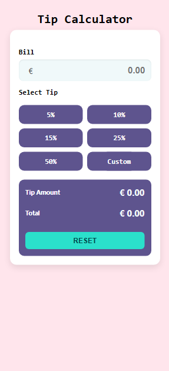
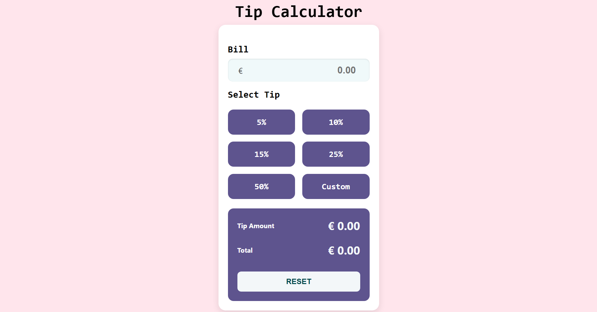

Of course — here is your **optimized and professional `README.md`** version, with clean structure, no emojis, and a formal tone suitable for an IT portfolio or job application:

---

```md
# Tip Calculator

This is a full-stack Tip Calculator application developed using **Spring Boot (Java)** and **Vanilla JavaScript**.  
It allows users to input a bill amount, choose or enter a custom tip percentage, and split the bill among multiple people. The application calculates the tip amount, total amount, and amount per person via a RESTful API.

---

## Features

- Real-time calculation of:
  - Tip amount
  - Total amount
  - Amount per person
- Selectable or custom tip percentages
- Responsive and mobile-friendly design
- Clean separation between backend and frontend
- REST API with JSON response format

---

## Technology Stack

| Layer     | Technology              |
|-----------|-------------------------|
| Backend   | Java 17, Spring Boot    |
| Frontend  | HTML, CSS, JavaScript   |
| API Style | REST (JSON-based)       |
| Build Tool| Maven                   |
| Testing   | Postman (for API testing) |

---

## Project Structure

```

tipcalculator/
├── src/
│   └── main/
│       ├── java/          # Backend source code
│       └── resources/     # Static HTML, CSS, JS
├── target
├── screenshots
├── Dockerfile
├── pom.xml
├── README.md

````

---

## Getting Started

### Prerequisites

To run this project locally, you will need:

- Java 17 or later
- Maven 3.8+
- A web browser

### Build and Run

1. Clone the repository:
   ```bash
   git clone https://github.com/your-username/tipcalculator.git
   cd tipcalculator
````

2. Build the project using Maven:

   ```bash
   mvn clean install
   ```

3. Run the Spring Boot application:

   ```bash
   mvn spring-boot:run
   ```

4. Open the application in your browser:

   ```
   http://localhost:8080
   ```

---

## Screenshots

### Mobile View (iPhone 12)



### Desktop View



---

## Deployment

The application can be deployed locally or containerized using Docker.

### Using Docker

1. Build the Docker image:

   ```bash
   docker build -t tipcalculator .
   ```

2. Run the container:

   ```bash
   docker run -p 8080:8080 tipcalculator
   ```

Then open your browser at `http://localhost:8080`.

---

## License

This project is released as open source under the MIT License.

```

